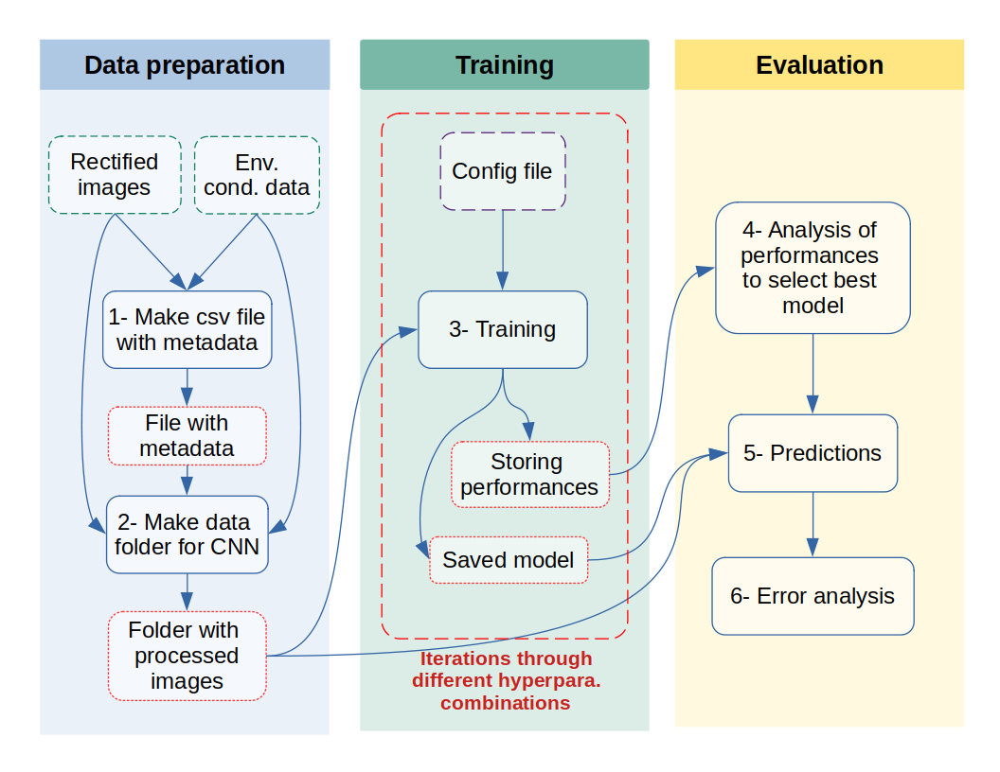

# Bathymetric inversion for nearshore areas with video monitoring and deep learning


## Description

This repository contains python tools to perform bathymetric inversion based on deep learning algorithms. The deep learning algorithms (Unet and Pix2Pix) are implemented in tensorflow. 
During training, you have the choice to train on CPU or GPU if you have one.

## Getting Started

### Dependencies

* This project was built with **python 3.8.13**
* All the required dependencies are listed in the requirements.txt file.

### Installing

0. Ensure **python 3.8.13** is installed on your computer

1. Download or clone this repository at the location of your choice

2. Create a virtual environment with **python 3.8.13** (this python version must be installed):

    + virtualenv
    
    ```
    virtualenv -p python3.8.13 [env name]
    ```

    + conda 

    ```
    conda create --name [env name] python=3.8.13 
    ```

3. Activate your virtual environment and download the required dependencies:

    + virtualenv
    
    ```
    source [env name]/bin/activate
    pip3 install -r requirements.txt
    ```

    + conda 

    ```
    conda activate [env name]
    conda install --file requirements.txt
    ```

### Executing program

#### General workflow 



#### Processing data before training 

This processing step was developped specifically for Biarritz site. This are the steps to follow: 

1. Define the settings for data preparation by modifying `./configs/Setting_data.py`. All the settings are explained in the python file. 

2. Launch the following command line: 

    ```
    python3 generate_dataset.py [metadata.csv] [Output_dir]
    ```
    
    where `[metadata.csv]` is the file with all the metadata about the images.
    If not present in `data_CNN/Data_processed` repository, it will be created and stored in this repository.
    The`[Output_dir]` is the name of the repository where you want all the prepared data for the CNN training. 
    The repository structure is specifically created to work with keras data loading procedures.


#### Training the models 

There are two ways to train the models:

* With a unique configuration file: 
    
    1. Define the hyperparameters of the networks in the json file located in  `./config`
    
    2. Launch the following command line: 
    
        ```
        python3 train.py [gpu] [Name of config file]
        ```
        where `[gpu]` is an option to perform the trainng with (1) or without (0) a gpu. 
    
    3. Unet and Pix2pix models will be trained. At the end of the training, all the output are saved in the following repository : `trained_models/`.
    The hyperameters and performances on the test set are saved in `Results_test.csv` and the models are saved directly in the previously mentioned repository.      
     
* With several configuration files:
    1. Create different configuration file in `./config` with the hyperparameters you want to test (same json format). 

    2. Run the following bash command to train all the networks by iterating over the different config file in `./config`.
        
        ```
        bash train_configs.sh [env name]
        ```    
    3. Inspect the results in `trained_models/`.

## Authors

Aurelien Callens

## References

Inspiration, code snippets: 
* Unet architecture, metrics: [Collins et al.](https://github.com/collins-frf/Celerity_Net)
* Training GAN in keras with .fit_generator() [Daniel Möller (Stackoverflow)](https://stackoverflow.com/questions/58785715/training-gan-in-keras-with-fit-generator?noredirect=1&lq=1)